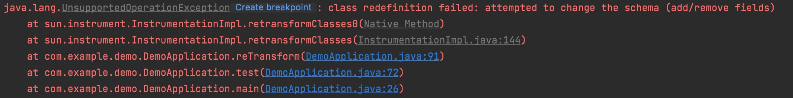

# skywalking-byte-buddy-cache-agent

# 概述		

skywalking底层是基于bytebuddy作为字节码增强框架，而bytebuddy在增强的时候会生成auxiliary的匿名内部类。但是匿名内部类在每次retransform的时候类名都会发生变化，导致在skywalking的基础上引入其他agent会直接抛UnsupportedOperationException。异常截图如下。



​	arthas也遇到了类似的[问题]( https://github.com/alibaba/arthas/issues/1141)

​	skywalking的官方也给出了[解决方案](https://github.com/apache/skywalking/blob/master/docs/en/FAQ/Compatible-with-other-javaagent-bytecode-processing.md) ，在启动skywalking的时候通过增加 

```shell
-Dskywalking.agent.is_cache_enhanced_class=true 
-Dskywalking.agent.class_cache_mode=MEMORY
```

这两个启动参数将class数据加到缓存中，避免重新retransform的时候生成新的匿名内部类。

可是如果使用低版本的skywalking或者其他基于bytebuddy进行字节码增强的agent还是会遇到这个问题。

所以这个项目的目的是为了解决bytebuddy进行字节码增强匿名内部类名变化导致出现 UnsupportedOperationException的问题。

---

# 使用

1. 执行

   ```shell
   mvn install -Dmaven.test.skip=true
   ```

   进行打包

2. 添加项目启动参数

   ```shell
   -javaagent:${jarPath}/skywalking-byte-buddy-cache-agent-1.0.0.jar
   ```

   **ps:一定得添加在skywalking agent之前，不然不生效。**

   默认是开启缓存，缓存类型是memory

如果需要关闭agent或使用file作为存储可以在添加启动参数

```shell
-DbyteBuddyCache.enable=false
-DbyteBuddyCache.cacheMode=file
```

目前cacheMode只支持 file 和 memory

---

## 版本1.0.0

1. 暂时只支持skywalking中bytebuddy增强遇到的问题。
2. 支持主动开启和关闭缓存。ps：但只在应用重启是才生效。
3. 支持MEMORY和FILE两种缓存机制。

<font color=red >注意：skywalking-byte-buddy-cache-agent得在skywalking前进行加载，不然还是不生效</font>

---

## 最后

作者水平有限，有问题欢迎指正！ღ( ´･ᴗ･` )比心
